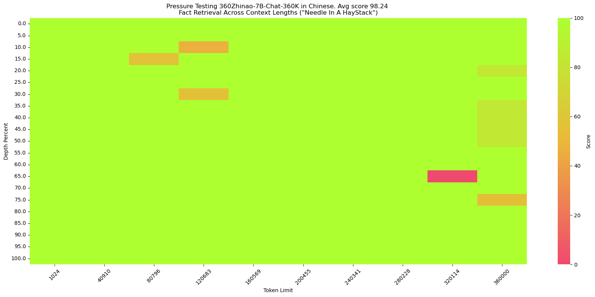
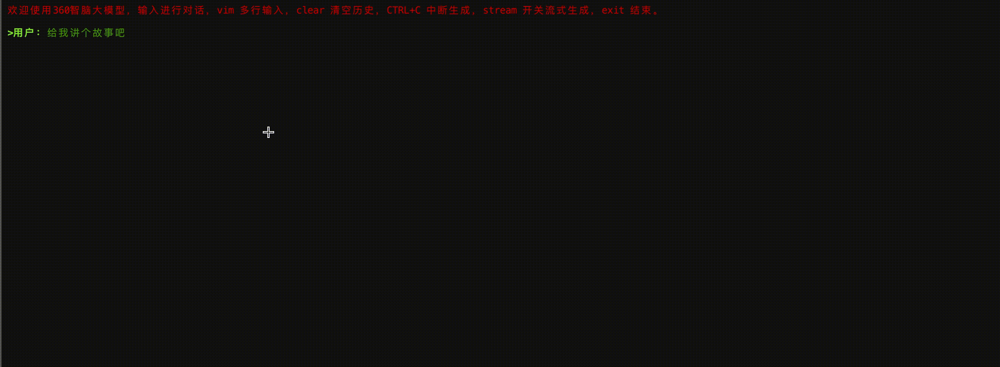
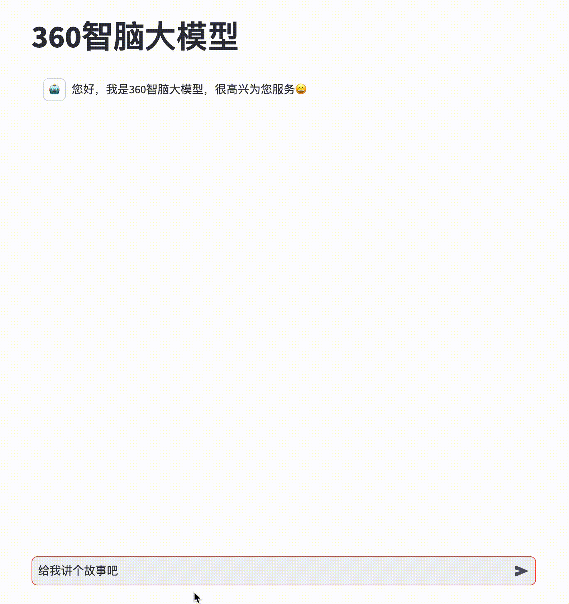

<p align="left">
    <a href="./README_CN.md">中文</a> ｜ &nbsp English</a>&nbsp
</p>
<br>

<div align="center">
<h1>
  360Zhinao (360智脑)
</h1>
</div>
<div align="center">
    🤗 <a href="https://huggingface.co/qihoo360">HuggingFace</a>&nbsp&nbsp | &nbsp&nbsp
    🤖 <a href="https://www.modelscope.cn/profile/qihoo360">ModelScope</a>&nbsp&nbsp ｜ &nbsp&nbsp
    💬 <a href="./assets/WeChat.png">WeChat (微信)</a>&nbsp&nbsp
</div>
<br>
<p align="center">
 Feel free to visit 360Zhinao's official website<a href="https://ai.360.com"> https://ai.360.com</a> for more experience.
</p>

<br>

# Introduction
 🎉🎉🎉 We released the 360Zhinao model series:
 - **360Zhinao-7B-Base**
 - **360Zhinao-7B-Chat-4K**
 - **360Zhinao-7B-Chat-32K**
 - **360Zhinao-7B-Chat-360K**

Notable features of our 360Zhinao models are:

- **Base Model:** Leveraging a high-quality corpus of 3.4 trillion tokens consisting of mainly Chinese, English and code, we achieved competitive performance on relevant benchmarks against other 7B models.
- **Chat Models:** Powerful chat capabilities and three context lengths of 4K, 32K and 360K. 360K (around 500k Chinese characters) is the longest context length among Chinese open-sourced models upon release (Apr. 11, 2024).

<br>

# News and Updates
- [2024.04.12] We released **360Zhinao-7B** v1.0, including the base model and three chat models with context lengths 4K, 32K and 360K. 

<br>

# Table of contents
- [Download URL](#Download-URL)
- [Model Evaluation](#Model-Evaluation)
- [Quickstart](#Quickstart)
- [Model Inference](#Model-Inference)
- [Model Finetune](#Model-Finetune)
- [License](#License)

<br>

# Download URL

| Size | Model | BF16 | Int4|
|-|-|-|-|
| 7B | 360Zhinao-7B-Base | <a href="https://www.modelscope.cn/models/qihoo360/360Zhinao-7B-Base/summary">🤖</a>  <a href="https://huggingface.co/qihoo360/360Zhinao-7B-Base">🤗</a> |  |
| 7B | 360Zhinao-7B-Chat-4K | <a href="https://www.modelscope.cn/models/qihoo360/360Zhinao-7B-Chat-4K/summary">🤖</a>  <a href="https://huggingface.co/qihoo360/360Zhinao-7B-Chat-4K">🤗</a> | <a href="https://www.modelscope.cn/models/qihoo360/360Zhinao-7B-Chat-4K-Int4/summary">🤖</a>  <a href="https://huggingface.co/qihoo360/360Zhinao-7B-Chat-4K-Int4">🤗</a> |
| 7B | 360Zhinao-7B-Chat-32K | <a href="https://www.modelscope.cn/models/qihoo360/360Zhinao-7B-Chat-32K/summary">🤖</a>  <a href="https://huggingface.co/qihoo360/360Zhinao-7B-Chat-32K">🤗</a> | <a href="https://www.modelscope.cn/models/qihoo360/360Zhinao-7B-Chat-32K-Int4/summary">🤖</a>  <a href="https://huggingface.co/qihoo360/360Zhinao-7B-Chat-32K-Int4">🤗</a> |
| 7B | 360Zhinao-7B-Chat-360K | <a href="https://www.modelscope.cn/models/qihoo360/360Zhinao-7B-Chat-360K/summary">🤖</a>  <a href="https://huggingface.co/qihoo360/360Zhinao-7B-Chat-360K">🤗</a> | <a href="https://www.modelscope.cn/models/qihoo360/360Zhinao-7B-Chat-360K-Int4/summary">🤖</a>  <a href="https://huggingface.co/qihoo360/360Zhinao-7B-Chat-360K-Int4">🤗</a> |

<br>

# Model Evaluation
## Base Model
We evaluate our model on [OpenCompass](https://opencompass.org.cn/home), more specifically on C-Eval, AGIEval, MMLU, CMMLU, HellaSwag, MATH, GSM8K, HumanEval, MBPP, BBH and LAMBADA. 
These benchmarks test the model on
natural language understanding, knowledge, mathematics, code generation and logical reasoning, etc.

Results are listed as follows and could be viewed or reproduced on [OpenCompass leaderboard](https://rank.opencompass.org.cn/leaderboard-llm).

| <div style="width: 100pt">Model</div> | AVG   | CEval | AGIEval | MMLU | CMMLU | HellaSwag | MATH | GSM8K | HumanEval | MBPP | BBH | LAMBADA |
|:----------------------|:---------:|:---------:|:---------:|:---------:|:---------:|:---------:|:---------:|:---------:|:---------:|:---------:|:---------:|:---------:|
| Baichuan2-7B          | 41.49     | 56.3      | 34.6      | 54.7      | 57        | 67        | 5.4       | 24.6      | 17.7      | 24        | 41.8      | 73.3      |
| Baichuan-7B           | 31.94     | 44.7      | 24.6      | 41.5      | 44.6      | 68.4      | 2.5       | 9.6       | 9.1       | 6.4       | 32.8      | 67.1      |
| ChatGLM3-6B           | **58.67** | 67        | 47.4      | 62.8      | 66.5      | 76.5      | 19.2      | 61        | 44.5      | **57.2**  | **66.2**  | 77.1      |
| DeepSeek-7B           | 39.8      | 45        | 24        | 49.3      | 46.8      | 73.4      | 4.2       | 18.3      | 25        | 36.4      | 42.8      | 72.6      |
| InternLM2-7B          | 58.01     | 65.7      | 50.2      | 65.5      | 66.2      | 79.6      | 19.9      | **70.6**  | 41.5      | 42.4      | 64.4      | 72.1      |
| InternLM-7B           | 39.33     | 53.4      | 36.9      | 51        | 51.8      | 70.6      | 6.3       | 31.2      | 13.4      | 14        | 37        | 67        |
| LLaMA-2-7B            | 33.27     | 32.5      | 21.8      | 46.8      | 31.8      | 74        | 3.3       | 16.7      | 12.8      | 14.8      | 38.2      | 73.3      |
| LLaMA-7B              | 30.35     | 27.3      | 20.6      | 35.6      | 26.8      | 74.3      | 2.9       | 10        | 12.8      | 16.8      | 33.5      | 73.3      |
| Mistral-7B-v0.1       | 47.67     | 47.4      | 32.8      | 64.1      | 44.7      | 78.9      | 11.3      | 47.5      | 27.4      | 38.6      | 56.7      | 75        |
| MPT-7B                | 30.06     | 23.5      | 21.3      | 27.5      | 25.9      | 75        | 2.9       | 9.1       | 17.1      | 22.8      | 35.6      | 70        |
| Qwen1.5-7B            | 55.12     | 73.57     | **50.8**  | 62.15     | 71.84     | 72.62     | **20.36** | 54.36     | **53.05** | 36.8      | 40.01     | 70.74     |
| Qwen-7B               | 49.53     | 63.4      | 45.3      | 59.7      | 62.5      | 75        | 13.3      | 54.1      | 27.4      | 31.4      | 45.2      | 67.5      |
| XVERSE-7B             | 34.27     | 61.1      | 39        | 58.4      | 60.8      | 73.7      | 2.2       | 11.7      | 4.9       | 10.2      | 31        | 24        |
| Yi-6B                 | 47.8      | 73        | 44.3      | 64        | **73.5**  | 73.1      | 6.3       | 39.9      | 15.2      | 23.6      | 44.9      | 68        |
| **360Zhinao-7B**      | 56.15     | **74.11** | 49.49     | **67.44** | 72.38     | **83.05** | 16.38     | 53.83     | 35.98     | 42.4      | 43.95     | **78.59** |


## Chat Models

The 4K and 32K models are trained separately with the same 4K SFT data.

To train the long-context models, we adopted a two-stage approach.

**First stage**: We increased RoPE base and extended the context length to 32K.
- Firstly, we performed Continual Pretraining on approximately 5B tokens with a 32K context window.
- Then during the SFT stage, we finetuned the model using long data from various sources, including high-quality human-labeled 32K data.

**Second stage**: We extended the context length to 360K, training with the following data:
- A small amount of high-quality human-labeled super-long data.
- Due to the scarcity of annotated super-long data, we constructed various forms of synthetic data.
    - Multi-Doc QA: Similar to [Ziya-Reader](https://arxiv.org/abs/2311.09198), we generated multi-document QA pairs based on 360's database. Multiple QA pairs are constructed for one row of Multi-Doc QA data input, resulting in a multi-turn format and significantly improving the training efficiency.
    - Single-Doc QA: Similar to [LLama2 Long](https://arxiv.org/abs/2309.16039), we constructed multi-turn QA data based on different segments within one row of long-text input.

We evaluated our models across various lengths and benchmarks.

- ### Long Context Benchmarks


  We evaluated our 32K and 360K models on [LongBench](https://github.com/THUDM/LongBench), a multi-task bilingual benchmark for long contexts. We report results on **Chinese** tasks most relevant to downstream applications: Single/Multi-Doc QA, Summarization, Few-Shot Learning and Code Completion.

    | Model                     | Avg       | Single-Doc QA  | Multi-Doc QA | Summarization | Few-Shot Learning | Code Completion |
    | :------------------------ |:---------:|:--------:|:---------:|:---------:|:------------:|:---------:|
    | GPT-3.5-Turbo-16k         | 37.84     | 61.2     | 28.7      | 16        | 29.2         | 54.1      |
    | ChatGLM2-6B-32k           | 37.16     | 51.6     | 37.6      | 16.2      | 27.7         | 52.7      |
    | ChatGLM3-6B-32k           | 44.62     | **62.3** | 44.8      | 17.8      | 42           | 56.2      |
    | InternLM2-Chat-7B         | 42.20     | 56.65    | 29.15     | **17.99** | 43.5         | **63.72** |
    | Qwen1.5-Chat-7B           | 36.75     | 52.85    | 30.08     | 14.28     | 32           | 54.55     |
    | Qwen1.5-Chat-14B          | 39.80     | 60.39    | 27.99     | 14.77     | 37           | 58.87     |
    | 360Zhinao-7B-Chat-32K     | **45.18** | 57.18    | **48.06** | 15.03     | **44**       | 61.64     |

- ### 360Zhinao-7B-Chat-360K on "NeedleInAHaystack"

  [NeedleInAHaystack](https://github.com/gkamradt/LLMTest_NeedleInAHaystack) places one small piece of information in different positions of long text and queries this information as a test of LLM's long-context capabilities.

  360Zhinao-7B-Chat-360K could achieve over 98% accuracy on both English and Chinese NeedleInAHaystack tasks.

  - English version（same as [NeedleInAHaystack](https://github.com/gkamradt/LLMTest_NeedleInAHaystack)）
  
    <p align="center">
        
    <p>

    **needle**：The best thing to do in San Francisco is eat a sandwich and sit in Dolores Park on a sunny day.

    **query**：What is the best thing to do in San Francisco?


  - Chinese version

    <p align="center">
        
    <p>

    We constructed the Chinese version following the [SuperCLUE-200K benchmark](https://mp.weixin.qq.com/s/QgoRf2LB-7vc3vTFOHJkpw):

    **haystack**：Chinese novels.
  
    **needle**：(in Chinese) 王莽是一名勤奋的店员，他每天凌晨就起床，赶在第一缕阳光照亮大地之前到达店铺，为即将开始的一天做准备。他清扫店铺，整理货架，为顾客提供方便。他对五金的种类和用途了如指掌，无论顾客需要什么，他总能准确地找到。\n然而，他的老板刘秀却总是对他吹毛求疵。刘秀是个挑剔的人，他总能在王莽的工作中找出一些小错误，然后以此为由扣他的工资。他对王莽的工作要求非常严格，甚至有些过分。即使王莽做得再好，刘秀也总能找出一些小问题，让王莽感到非常沮丧。\n王莽虽然对此感到不满，但他并没有放弃。他知道，只有通过自己的努力，才能获得更好的生活。他坚持每天早起，尽管他知道那天可能会再次被刘秀扣工资。他始终保持微笑，尽管他知道刘秀可能会再次对他挑剔。

    **query**：(in Chinese) 王莽在谁的手下工作？

<br>

# Quickstart
We provide simple examples illustrating the use of 360Zhinao-7B-Base and 360Zhinao-7B-Chat on 🤖ModelScope and 🤗Transformers.

## Dependency Installation
- python >= 3.8
- pytorch >= 2.0
- transformers >= 4.37.2
- CUDA >= 11.4

```shell
pip install -r requirements.txt 
```

Optionally, we recommend installing Flash-Attention 2 to improve performance and reduce memory footprint.

>flash-attn >= 2.3.6
```shell
FLASH_ATTENTION_FORCE_BUILD=TRUE pip install flash-attn==2.3.6
```

## 🤗 Transformers
### Demonstration of Base Model Inference

```python
from transformers import AutoTokenizer, AutoModelForCausalLM
from transformers.generation import GenerationConfig

MODEL_NAME_OR_PATH = "qihoo360/360Zhinao-7B-Base"

tokenizer = AutoTokenizer.from_pretrained(
    MODEL_NAME_OR_PATH, 
    trust_remote_code=True)

model = AutoModelForCausalLM.from_pretrained(
    MODEL_NAME_OR_PATH,
    device_map="auto",
    trust_remote_code=True)

generation_config = GenerationConfig.from_pretrained(
    MODEL_NAME_OR_PATH,
    trust_remote_code=True)

inputs = tokenizer('中国二十四节气\n1. 立春\n2. 雨水\n3. 惊蛰\n4. 春分\n5. 清明\n', return_tensors='pt')
inputs = inputs.to(model.device)

pred = model.generate(input_ids=inputs["input_ids"], generation_config=generation_config)
print("outputs:\n", tokenizer.decode(pred.cpu()[0], skip_special_tokens=True))
```
### Demonstration of Chat Model Inference

```python
from transformers import AutoTokenizer, AutoModelForCausalLM
from transformers.generation import GenerationConfig

MODEL_NAME_OR_PATH = "qihoo360/360Zhinao-7B-Chat-4K"

tokenizer = AutoTokenizer.from_pretrained(
    MODEL_NAME_OR_PATH, 
    trust_remote_code=True)

model = AutoModelForCausalLM.from_pretrained(
    MODEL_NAME_OR_PATH,
    device_map="auto",
    trust_remote_code=True)

generation_config = GenerationConfig.from_pretrained(
    MODEL_NAME_OR_PATH,
    trust_remote_code=True)

messages = []
#round-1
messages.append({"role": "user", "content": "介绍一下刘德华"})
response = model.chat(tokenizer=tokenizer, messages=messages, generation_config=generation_config)
messages.append({"role": "assistant", "content": response})
print(messages)

#round-2
messages.append({"role": "user", "content": "他有什么代表作？"})
response = model.chat(tokenizer=tokenizer, messages=messages, generation_config=generation_config)
messages.append({"role": "assistant", "content": response})
print(messages)
```

## 🤖 ModelScope
### Demonstration of Base Model Inference

```python
from modelscope import AutoModelForCausalLM, AutoTokenizer
from modelscope import GenerationConfig

MODEL_NAME_OR_PATH = "qihoo360/360Zhinao-7B-Base"

tokenizer = AutoTokenizer.from_pretrained(
    MODEL_NAME_OR_PATH, 
    trust_remote_code=True)

model = AutoModelForCausalLM.from_pretrained(
    MODEL_NAME_OR_PATH,
    device_map="auto",
    trust_remote_code=True)

generation_config = GenerationConfig.from_pretrained(
    MODEL_NAME_OR_PATH,
    trust_remote_code=True)

inputs = tokenizer('中国二十四节气\n1. 立春\n2. 雨水\n3. 惊蛰\n4. 春分\n5. 清明\n', return_tensors='pt')
inputs = inputs.to(model.device)

pred = model.generate(input_ids=inputs["input_ids"], generation_config=generation_config)
print("outputs:\n", tokenizer.decode(pred.cpu()[0], skip_special_tokens=True))
```

### Demonstration of Chat Model Inference

```python
from modelscope import AutoModelForCausalLM, AutoTokenizer
from modelscope import GenerationConfig

MODEL_NAME_OR_PATH = "qihoo360/360Zhinao-7B-Chat-4K"

tokenizer = AutoTokenizer.from_pretrained(
    MODEL_NAME_OR_PATH, 
    trust_remote_code=True)

model = AutoModelForCausalLM.from_pretrained(
    MODEL_NAME_OR_PATH,
    device_map="auto",
    trust_remote_code=True)

generation_config = GenerationConfig.from_pretrained(
    MODEL_NAME_OR_PATH,
    trust_remote_code=True)

messages = []
#round-1
messages.append({"role": "user", "content": "介绍一下刘德华"})
response = model.chat(tokenizer=tokenizer, messages=messages, generation_config=generation_config)
messages.append({"role": "assistant", "content": response})
print(messages)

#round-2
messages.append({"role": "user", "content": "他有什么代表作？"})
response = model.chat(tokenizer=tokenizer, messages=messages, generation_config=generation_config)
messages.append({"role": "assistant", "content": response})
print(messages)
```

## CLI Demo
Use terminal for command-line interface:

```shell
python cli_demo.py
```
<p align="center">
    
<p>

Note: for Mac users, `device = 'mps'` is not supported yet.

## Web Demo

```shell
streamlit run web_demo.py
```
<p align="center">
    
<p>

## API Demo
Launch api:
```shell
python openai_api.py
```

Then request with parameters:
```shell
curl 'http://localhost:8360/v1/chat/completions' \
-H 'Content-Type: application/json' \
-d '{
    "max_new_tokens": 200,
    "do_sample": true,
    "top_k": 0,
    "top_p": 0.8,
    "temperature": 1.0,
    "repetition_penalty": 1.0,
    "messages": [
        {"role": "system", "content": "You are a helpful assistant."},
        {"role": "user", "content": "你好"}
    ]
}'
```

<br>

# Model Inference
## Quantization
We provide quantization schemes based on AutoGPTQ and release the Int4 quantization models. 

## Deployment
### vLLM Installation
We recommend using `vLLM==0.3.3`.

If you are using **CUDA 12.1 and PyTorch 2.1**, you can install vLLM directly with:
```shell
pip install vllm==0.3.3
```

Otherwise, please refer to the official vLLM [Installation Instructions](https://docs.vllm.ai/en/latest/getting_started/installation.html).

After installation, perform the following steps:
1. Copy `vllm/zhinao.py` into `vllm/model_executor/models` in your vllm installation directory (in python/conda env).
2. Copy `vllm/serving_chat.py` into `vllm/entrypoints/openai` in your vllm installation directory.
3. Then add a line in `vllm/model_executor/models/__init__.py`

    ```shell
    "ZhinaoForCausalLM": ("zhinao", "ZhinaoForCausalLM"),
    ```

### vLLM Service Start

Start the service:
```shell
python -m vllm.entrypoints.openai.api_server \
    --served-model-name 360Zhinao-7B-Chat-4K \
    --model qihoo360/360Zhinao-7B-Chat-4K \
    --trust-remote-code \
    --tensor-parallel-size 1 \
    --max-model-len 4096 \
    --host 0.0.0.0 \
    --port 8360
```

Use curl to request the service:
```shell
curl http://localhost:8360/v1/chat/completions \
-H "Content-Type: application/json" \
-d '{
    "model": "360Zhinao-7B-Chat-4K",
    "max_tokens": 200,
    "top_k": -1,
    "top_p": 0.8,
    "temperature": 1.0,
    "presence_penalty": 0.0,
    "frequency_penalty": 0.0,
    "messages": [
        {"role": "system", "content": "You are a helpful assistant."},
        {"role": "user", "content": "你好"}
    ],
    "stop": [
        "<eod>",
        "<|im_end|>",
        "<|im_start|>"
    ]
}'
```
Use python to request the service:
```python
from openai import OpenAI
openai_api_key = "EMPTY"
openai_api_base = "http://localhost:8360/v1"

client = OpenAI(
    api_key=openai_api_key,
    base_url=openai_api_base,
)

chat_response = client.chat.completions.create(
    model="360Zhinao-7B-Chat-4K",
    messages=[
        {"role": "system", "content": "You are a helpful assistant."},
        {"role": "user", "content": "你好"},
    ],
    stop=[
        "<eod>",
        "<|im_end|>",
        "<|im_start|>"
    ],
    presence_penalty=0.0,
    frequency_penalty=0.0
)
print("Chat response:", chat_response)
```

> If you need to enable repetition penalty, we recommend setting `presence_penalty` and `frequency_penalty` instead of `repetition_penalty`.


<br>

# Model Finetune
## Training data

Training Data: `data/training_data_sample.json`. This example data has 10,000 rows sampled from [multiturn_chat_0.8M](https://huggingface.co/datasets/BelleGroup/multiturn_chat_0.8M) with converted format.

Data Format:
```json
[
  {
    "id": 1,
    "conversations": [
        {
            "from": "system",
            "value": "You are a helpful assistant."
        },
        {
            "from": "user",
            "value": "您好啊"
        },
        {
            "from": "assistant",
            "value": "你好！我今天能为您做些什么？有什么问题或需要帮助吗? 我在这里为您提供服务。"
        }
    ]
  }
]
```
## Finetuning scripts
```shell
set -x

HOSTFILE=hostfile
DS_CONFIG=./finetune/ds_config_zero2.json

# PARAMS
LR=5e-6
EPOCHS=3
MAX_LEN=4096
BATCH_SIZE=4
NUM_NODES=1
NUM_GPUS=8
MASTER_PORT=29500

IS_CONCAT=False # Whether to concatenate to maximum length (MAX_LEN)

DATA_PATH="./data/training_data_sample.json"
MODEL_PATH="qihoo360/360Zhinao-7B-Base"
OUTPUT_DIR="./outputs/"

deepspeed --hostfile ${HOSTFILE} \
        --master_port ${MASTER_PORT} \
        --num_nodes ${NUM_NODES} \
        --num_gpus ${NUM_GPUS} \
        finetune.py \
        --report_to "tensorboard" \
        --data_path ${DATA_PATH} \
        --model_name_or_path ${MODEL_PATH} \
        --output_dir ${OUTPUT_DIR} \
        --model_max_length ${MAX_LEN} \
        --num_train_epochs ${EPOCHS} \
        --per_device_train_batch_size ${BATCH_SIZE} \
        --gradient_accumulation_steps 1 \
        --save_strategy steps \
        --save_steps 200 \
        --learning_rate ${LR} \
        --lr_scheduler_type cosine \
        --adam_beta1 0.9 \
        --adam_beta2 0.95 \
        --adam_epsilon 1e-8 \
        --max_grad_norm 1.0 \
        --weight_decay 0.1 \
        --warmup_ratio 0.01 \
        --gradient_checkpointing True \
        --bf16 True \
        --tf32 True \
        --deepspeed ${DS_CONFIG} \
        --is_concat ${IS_CONCAT} \
        --logging_steps 1 \
        --log_on_each_node False
```
```shell
bash finetune/ds_finetune.sh
```
- Configuring `HOSTFILE` switches between single-machine and multi-machine training.
- configuring `ds_config` switches between zero1, zero2 and zero3.
- `fp16, bf16` could configure mixed precision training. bf16 is recommended to be consistent with the pretrained model.
- `is_concat` configures whether the training data is concatenated or not.

<br>

# License

The source code of this repository follows the open-source license Apache 2.0.

360​Zhinao open-source models support commercial use. If you wish to use these models or continue training them for commercial purposes, please contact us via email (g-zhinao-opensource@360.cn) to apply. For the specific license agreement, please see [<<360 Zhinao Open-Source Model License>>](https://github.com/Qihoo360/360zhinao/blob/main/360%E6%99%BA%E8%84%91%E5%BC%80%E6%BA%90%E6%A8%A1%E5%9E%8B%E8%AE%B8%E5%8F%AF%E8%AF%81.txt).
