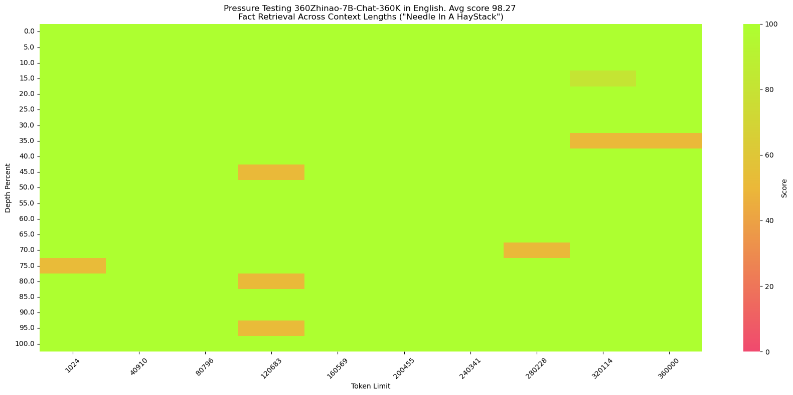

<p align="left">
    <a href="./README.md">中文</a> ｜ &nbsp English</a>&nbsp
</p>
<br>

<div align="center">
<h1>
  360Zhinao (360智脑)
</h1>
</div>
<div align="center">
    🤗 <a href="https://huggingface.co/qihoo360">Hugging Face</a>&nbsp&nbsp | &nbsp&nbsp
    🤖 <a href="https://www.modelscope.cn/profile/qihoo360">ModelScope</a>&nbsp&nbsp ｜ &nbsp&nbsp
    💬 <a href="./assets/WeChat.png">WeChat (微信)</a>&nbsp&nbsp
</div>
<br>
<p align="center">
 Feel free to visit 360Zhinao's official website<a href="https://ai.360.com"> https://ai.360.com</a> for more experience.
</p>

<br>

# Models Introduction
 🎉🎉🎉We open-source the 360Zhinao model series:
 - **360Zhinao-7B-Base**
 - **360Zhinao-7B-Chat-4K**
 - **360Zhinao-7B-Chat-32K**
 - **360Zhinao-7B-Chat-360K**


The characteristics of the 360Zhinao open-source models are：
- **Base Model:** Leveraging a high-quality corpus of 3.4 trillion Tokens which mainly consist of Chinese, English and code, we achieved competitive performance on relevant benchmark evaluations of the same model scale.
- **Chat Model:** Powerful chat capabilities and three different sequence lengths of 4K, 32K and 360K. 360K (about 500k Chinese characters) is the longest sequcence length among open-sourced Chinese models until now.

<br>

# News and Updates
- 2024.04.11 We release **360Zhinao-7B** 1.0 version,  include the base model and three chat model with sequence lengths of 4K, 32K adn 360K. 

<br>

# Table of contents
- [Download URL](#Download-URL)
- [Model Evaluation](#Model-Evaluation)
- [Quickstart](#Quickstart)
- [Model Inference](#Model-Inference)
- [Model Finetune](#Model-Finetune)
- [License](#License)

<br>

# Download URL
See the following table for this release and download links:
| Size | Model | BF16 | Int4|
|-|-|-|-|
| 7B | 360Zhinao-7B-Base | <a href="https://www.modelscope.cn/models/qihoo360/360Zhinao-7B-Base/summary">🤖</a>  <a href="https://huggingface.co/qihoo360/360Zhinao-7B-Base">🤗</a> |  |
| 7B | 360Zhinao-7B-Chat-4K | <a href="https://www.modelscope.cn/models/qihoo360/360Zhinao-7B-Chat-4K/summary">🤖</a>  <a href="https://huggingface.co/qihoo360/360Zhinao-7B-Chat-4K">🤗</a> | <a href="https://www.modelscope.cn/models/qihoo360/360Zhinao-7B-Chat-4K-Int4/summary">🤖</a>  <a href="https://huggingface.co/qihoo360/360Zhinao-7B-Chat-4K-Int4">🤗</a> |
| 7B | 360Zhinao-7B-Chat-32K | <a href="https://www.modelscope.cn/models/qihoo360/360Zhinao-7B-Chat-32K/summary">🤖</a>  <a href="https://huggingface.co/qihoo360/360Zhinao-7B-Chat-32K">🤗</a> | <a href="https://www.modelscope.cn/models/qihoo360/360Zhinao-7B-Chat-32K-Int4/summary">🤖</a>  <a href="https://huggingface.co/qihoo360/360Zhinao-7B-Chat-32K-Int4">🤗</a> |
| 7B | 360Zhinao-7B-Chat-360K | <a href="https://www.modelscope.cn/models/qihoo360/360Zhinao-7B-Chat-360K/summary">🤖</a>  <a href="https://huggingface.co/qihoo360/360Zhinao-7B-Chat-360K">🤗</a> | <a href="https://www.modelscope.cn/models/qihoo360/360Zhinao-7B-Chat-360K-Int4/summary">🤖</a>  <a href="https://huggingface.co/qihoo360/360Zhinao-7B-Chat-360K-Int4">🤗</a> |

<br>

# Model Evaluation
## Base Model
We evaluate the performance of our model on the OpenCompass evaluation datasets, including C-Eval, AGIEval, MMLU, CMMLU, HellaSwag, MATH, GSM8K, HumanEval, MBPP, BBH, LAMBADA. The ablity evaluated of model include natural language understanding, knowledge, mathematical computation and reasoning, code generation, logical reasoning, etc.

| <div style="width: 100pt">Model</div> | AVG   | CEval | AGIEval | MMLU | CMMLU | HellaSwag | MATH | GSM8K | HumanEval | MBPP | BBH | LAMBADA |
|:----------------------|:---------:|:---------:|:---------:|:---------:|:---------:|:---------:|:---------:|:---------:|:---------:|:---------:|:---------:|:---------:|
| Baichuan2-7B          | 41.49     | 56.3      | 34.6      | 54.7      | 57        | 67        | 5.4       | 24.6      | 17.7      | 24        | 41.8      | 73.3      |
| Baichuan-7B           | 31.94     | 44.7      | 24.6      | 41.5      | 44.6      | 68.4      | 2.5       | 9.6       | 9.1       | 6.4       | 32.8      | 67.1      |
| ChatGLM3-6B           | **58.67** | 67        | 47.4      | 62.8      | 66.5      | 76.5      | 19.2      | 61        | 44.5      | **57.2**  | **66.2**  | 77.1      |
| DeepSeek-7B           | 39.8      | 45        | 24        | 49.3      | 46.8      | 73.4      | 4.2       | 18.3      | 25        | 36.4      | 42.8      | 72.6      |
| InternLM2-7B          | 58.01     | 65.7      | 50.2      | 65.5      | 66.2      | 79.6      | 19.9      | **70.6**  | 41.5      | 42.4      | 64.4      | 72.1      |
| InternLM-7B           | 39.33     | 53.4      | 36.9      | 51        | 51.8      | 70.6      | 6.3       | 31.2      | 13.4      | 14        | 37        | 67        |
| LLaMA-2-7B            | 33.27     | 32.5      | 21.8      | 46.8      | 31.8      | 74        | 3.3       | 16.7      | 12.8      | 14.8      | 38.2      | 73.3      |
| LLaMA-7B              | 30.35     | 27.3      | 20.6      | 35.6      | 26.8      | 74.3      | 2.9       | 10        | 12.8      | 16.8      | 33.5      | 73.3      |
| Mistral-7B-v0.1       | 47.67     | 47.4      | 32.8      | 64.1      | 44.7      | 78.9      | 11.3      | 47.5      | 27.4      | 38.6      | 56.7      | 75        |
| MPT-7B                | 30.06     | 23.5      | 21.3      | 27.5      | 25.9      | 75        | 2.9       | 9.1       | 17.1      | 22.8      | 35.6      | 70        |
| Qwen1.5-7B            | 55.12     | 73.57     | **50.8**  | 62.15     | 71.84     | 72.62     | **20.36** | 54.36     | **53.05** | 36.8      | 40.01     | 70.74     |
| Qwen-7B               | 49.53     | 63.4      | 45.3      | 59.7      | 62.5      | 75        | 13.3      | 54.1      | 27.4      | 31.4      | 45.2      | 67.5      |
| XVERSE-7B             | 34.27     | 61.1      | 39        | 58.4      | 60.8      | 73.7      | 2.2       | 11.7      | 4.9       | 10.2      | 31        | 24        |
| Yi-6B                 | 47.8      | 73        | 44.3      | 64        | **73.5**  | 73.1      | 6.3       | 39.9      | 15.2      | 23.6      | 44.9      | 68        |
| **360Zhinao-7B**      | 56.15     | **74.11** | 49.49     | **67.44** | 72.38     | **83.05** | 16.38     | 53.83     | 35.98     | 42.4      | 43.95     | **78.59** |

The above results could be viewed or reproduced on [Opencompass](https://rank.opencompass.org.cn/leaderboard-llm).

## Chat Models

  We adopted a two-stage approach to train the long context models.

  **First stage**: We increased RoPE base and extended the context length to 32K.
    - Firstly, we performed Continual Pretraining on approximately 5B tokens with a 32K context window.
    - Then during the SFT stage, we fine-tuned the model using long data from various sources, including high-quality human-labeled 32K data.

  **Second stage**: We extended the context length to 360K, training with the following data:
    - A small amount of high-quality human-labeled super-long data.
    - Due to the scarcity of annotated super-long data, we constructed various forms of synthetic data.
        - Multi-Doc QA: Similar to [Ziya-Reader](https://arxiv.org/abs/2311.09198), we generated multi-document QA pairs based on 360's database. Multiple QA pairs are constructed for one row of Multi-Doc QA data input, resulting in a multi-turn format and significantly improving the training efficiency.
        - Single-Doc QA: Similar to [LLama2 Long](https://arxiv.org/abs/2309.16039), we constructed multi-turn QA data based on different segments within one row of long-text input.

We evaluated our models across various lengths and benchmarks.

- ### Long Context Benchmarks


  We evaluated our 32K and 360K models on [LongBench](https://github.com/THUDM/LongBench), a multi-task bilingual benchmark for long contexts. We report results on Chinese tasks that are the most relevant to downstream applications: Single/Multi-Doc QA, Summarization, Few-Shot Learning and Code Completion.

    | Model                     | Avg       | 单文档QA  | 多文档QA   | 摘要       | Few-shot学习 | 代码补全    |
    | :------------------------ |:---------:|:--------:|:---------:|:---------:|:------------:|:---------:|
    | GPT-3.5-Turbo-16k         | 37.84     | 61.2     | 28.7      | 16        | 29.2         | 54.1      |
    | ChatGLM2-6B-32k           | 37.16     | 51.6     | 37.6      | 16.2      | 27.7         | 52.7      |
    | ChatGLM3-6B-32k           | 44.62     | **62.3** | 44.8      | 17.8      | 42           | 56.2      |
    | InternLM2-Chat-7B         | 42.20     | 56.65    | 29.15     | **17.99** | 43.5         | **63.72** |
    | Qwen1.5-Chat-7B           | 36.75     | 52.85    | 30.08     | 14.28     | 32           | 54.55     |
    | Qwen1.5-Chat-14B          | 39.80     | 60.39    | 27.99     | 14.77     | 37           | 58.87     |
    | 360Zhinao-7B-Chat-32K     | **45.18** | 57.18    | **48.06** | 15.03     | **44**       | 61.64     |

- ### 360Zhinao-7B-Chat-360K on "NeedleInAHaystack"

  [NeedleInAHaystack](https://github.com/gkamradt/LLMTest_NeedleInAHaystack) places one small piece of information in different positions of long text and queries this information as a test of LLM's long-context capabilities.

  360Zhinao-7B-Chat-360K could achieve over 98% accuracy on both English and Chinese NeedleInAHaystack tasks.

  - English version（same as [NeedleInAHaystack](https://github.com/gkamradt/LLMTest_NeedleInAHaystack)）
  
    <p align="center">
        
    <p>

    **needle**：The best thing to do in San Francisco is eat a sandwich and sit in Dolores Park on a sunny day.

    **query**：What is the best thing to do in San Francisco?


  - Chinese version

    <p align="center">
        
    <p>

    We constructed the Chinese version following the [SuperCLUE-200K benchmark](https://mp.weixin.qq.com/s/QgoRf2LB-7vc3vTFOHJkpw):

    **haystack**：Chinese novels.
  
    **needle**：(in Chinese) 王莽是一名勤奋的店员，他每天凌晨就起床，赶在第一缕阳光照亮大地之前到达店铺，为即将开始的一天做准备。他清扫店铺，整理货架，为顾客提供方便。他对五金的种类和用途了如指掌，无论顾客需要什么，他总能准确地找到。\n然而，他的老板刘秀却总是对他吹毛求疵。刘秀是个挑剔的人，他总能在王莽的工作中找出一些小错误，然后以此为由扣他的工资。他对王莽的工作要求非常严格，甚至有些过分。即使王莽做得再好，刘秀也总能找出一些小问题，让王莽感到非常沮丧。\n王莽虽然对此感到不满，但他并没有放弃。他知道，只有通过自己的努力，才能获得更好的生活。他坚持每天早起，尽管他知道那天可能会再次被刘秀扣工资。他始终保持微笑，尽管他知道刘秀可能会再次对他挑剔。

    **query**：(in Chinese) 王莽在谁的手下工作？

<br>

# Quickstart
Simple examples to illustrate how to use 360Zhinao-7B-Base and 360Zhinao-7B-Chat quickly using 🤖 ModelScope and 🤗 Transformers

## Dependency Installation
- python 3.8 and above
- pytorch 2.0 and above
- transformers 4.37.2 and above
- CUDA 11.4 and above are recommended.

```shell
pip install -r requirements.txt 
```
We recommend installing Flash-Attention (which currently supports flash attention 2) to increase your performance and reduce your memory footprint. (flash-attention is optional and will work without installation)

>flash-attn >= 2.3.6
```shell
FLASH_ATTENTION_FORCE_BUILD=TRUE pip install flash-attn==2.3.6
```

## 🤗 Transformers
### Demonstration of Base Model Inference

This code demonstrates fast inference with 360Zhinao-7B-Base models using transformers.
```python
from transformers import AutoTokenizer, AutoModelForCausalLM
from transformers.generation import GenerationConfig

MODEL_NAME_OR_PATH = "qihoo360/360Zhinao-7B-Base"

tokenizer = AutoTokenizer.from_pretrained(
    MODEL_NAME_OR_PATH, 
    trust_remote_code=True)

model = AutoModelForCausalLM.from_pretrained(
    MODEL_NAME_OR_PATH,
    device_map="auto",
    trust_remote_code=True)

generation_config = GenerationConfig.from_pretrained(
    MODEL_NAME_OR_PATH,
    trust_remote_code=True)

inputs = tokenizer('中国二十四节气\n1. 立春\n2. 雨水\n3. 惊蛰\n4. 春分\n5. 清明\n', return_tensors='pt')
inputs = inputs.to(model.device)

pred = model.generate(input_ids=inputs["input_ids"], generation_config=generation_config)
print("outputs:\n", tokenizer.decode(pred.cpu()[0], skip_special_tokens=True))
```
### Demonstration of Chat Model Inference

This code demo uses transformers to quickly use the 360Zhinao-7B-Chat-4K model for inference.
```python
from transformers import AutoTokenizer, AutoModelForCausalLM
from transformers.generation import GenerationConfig

MODEL_NAME_OR_PATH = "qihoo360/360Zhinao-7B-Chat-4K"

tokenizer = AutoTokenizer.from_pretrained(
    MODEL_NAME_OR_PATH, 
    trust_remote_code=True)

model = AutoModelForCausalLM.from_pretrained(
    MODEL_NAME_OR_PATH,
    device_map="auto",
    trust_remote_code=True)

generation_config = GenerationConfig.from_pretrained(
    MODEL_NAME_OR_PATH,
    trust_remote_code=True)

messages = []
#round-1
messages.append({"role": "user", "content": "介绍一下刘德华"})
response = model.chat(tokenizer=tokenizer, messages=messages, generation_config=generation_config)
messages.append({"role": "assistant", "content": response})
print(messages)

#round-2
messages.append({"role": "user", "content": "他有什么代表作？"})
response = model.chat(tokenizer=tokenizer, messages=messages, generation_config=generation_config)
messages.append({"role": "assistant", "content": response})
print(messages)
```

## 🤖 ModelScope
### Demonstration of Base Model Inference

This code demonstrates using ModelScope to quickly use the 360Zhinao-7B-Base model for inference.

```python
from modelscope import AutoModelForCausalLM, AutoTokenizer
from modelscope import GenerationConfig

MODEL_NAME_OR_PATH = "qihoo360/360Zhinao-7B-Base"

tokenizer = AutoTokenizer.from_pretrained(
    MODEL_NAME_OR_PATH, 
    trust_remote_code=True)

model = AutoModelForCausalLM.from_pretrained(
    MODEL_NAME_OR_PATH,
    device_map="auto",
    trust_remote_code=True)

generation_config = GenerationConfig.from_pretrained(
    MODEL_NAME_OR_PATH,
    trust_remote_code=True)

inputs = tokenizer('中国二十四节气\n1. 立春\n2. 雨水\n3. 惊蛰\n4. 春分\n5. 清明\n', return_tensors='pt')
inputs = inputs.to(model.device)

pred = model.generate(input_ids=inputs["input_ids"], generation_config=generation_config)
print("outputs:\n", tokenizer.decode(pred.cpu()[0], skip_special_tokens=True))
```

### Demonstration of Chat Model Inference

This code demonstrates using ModelScope to quickly use the 360Zhinao-7B-Chat-4K model for inference.

```python
from modelscope import AutoModelForCausalLM, AutoTokenizer
from modelscope import GenerationConfig

MODEL_NAME_OR_PATH = "qihoo360/360Zhinao-7B-Chat-4K"

tokenizer = AutoTokenizer.from_pretrained(
    MODEL_NAME_OR_PATH, 
    trust_remote_code=True)

model = AutoModelForCausalLM.from_pretrained(
    MODEL_NAME_OR_PATH,
    device_map="auto",
    trust_remote_code=True)

generation_config = GenerationConfig.from_pretrained(
    MODEL_NAME_OR_PATH,
    trust_remote_code=True)

messages = []
#round-1
messages.append({"role": "user", "content": "介绍一下刘德华"})
response = model.chat(tokenizer=tokenizer, messages=messages, generation_config=generation_config)
messages.append({"role": "assistant", "content": response})
print(messages)

#round-2
messages.append({"role": "user", "content": "他有什么代表作？"})
response = model.chat(tokenizer=tokenizer, messages=messages, generation_config=generation_config)
messages.append({"role": "assistant", "content": response})
print(messages)
```

## CLI Demo
Use terminal interaction for a fast experience
```shell
python cli_demo.py
```
<p align="center">
    
<p>

## Web Demo
You can also use web interaction for a quick experience
```shell
streamlit run web_demo.py
```
<p align="center">
    
<p>

## API Demo
Start command
```shell
python openai_api.py
```

Request parameter
```shell
curl --location --request POST 'http://localhost:8360/v1/chat/completions' \
--header 'Content-Type: application/json' \
--data-raw '{
    "max_new_tokens": 200,
    "do_sample": true,
    "top_k": 0,
    "top_p": 0.8,
    "temperature": 1.0,
    "repetition_penalty": 1.0,
    "messages": [
        {
            "role": "user",
            "content": "你叫什么名字？"
        }
    ]
}'
```

<br>

# Model Inference
## Quantization
We provide quantization schemes based on AutoGPTQ and open source the Int4 quantization models. 

## Deployment
### vLLM Installation
If you want to deploy and accelerate inference, we recommend using `vLLM==0.3.3`。

If you are using **CUDA 12.1 and PyTorch 2.1**, you can install vLLM directly with the following command.
```shell
pip install vllm==0.3.3
```

Otherwise, please refer to the official vLLM [Installation Instructions](https://docs.vllm.ai/en/latest/getting_started/installation.html)。

>Once the installation is complete, you will need to do the following
1. Copy the vllm/zhinao.py file to the vllm/model_executor/models directory corresponding to your env environment.
2. Copy the vllm/serving_chat.py file to the vllm/entrypoints/openai corresponding to your env environment.
3. Then add a line to vllm/model_executor/models/\_\_init\_\_.py

    ```shell
    "ZhinaoForCausalLM": ("zhinao", "ZhinaoForCausalLM"),
    ```

### vLLM Service Start

Starting the service
```shell
python -m vllm.entrypoints.openai.api_server \
    --served-model-name 360Zhinao-7B-Chat-4K \
    --model qihoo360/360Zhinao-7B-Chat-4K \
    --trust-remote-code \
    --tensor-parallel-size 1 \
    --max-model-len 4096 \
    --host 0.0.0.0 \
    --port 8360
```

Use curl to request the service
```shell
curl http://localhost:8360/v1/chat/completions \
-H "Content-Type: application/json" \
-d '{
    "model": "360Zhinao-7B-Chat-4K",
    "max_tokens": 200,
    "top_k": -1,
    "top_p": 0.8,
    "temperature": 1.0,
    "presence_penalty": 0.0,
    "frequency_penalty": 0.0,
    "messages": [
        {"role": "system", "content": "You are a helpful assistant."},
        {"role": "user", "content": "你好"}
    ],
    "stop": [
        "<eod>",
        "<|im_end|>",
        "<|im_start|>"
    ]
}'
```
Use python to request the service
```python
from openai import OpenAI
openai_api_key = "EMPTY"
openai_api_base = "http://localhost:8360/v1"

client = OpenAI(
    api_key=openai_api_key,
    base_url=openai_api_base,
)

chat_response = client.chat.completions.create(
    model="360Zhinao-7B-Chat-4K",
    messages=[
        {"role": "system", "content": "You are a helpful assistant."},
        {"role": "user", "content": "你好"},
    ],
    stop=[
        "<eod>",
        "<|im_end|>",
        "<|im_start|>"
    ],
    presence_penalty=0.0,
    frequency_penalty=0.0
)
print("Chat response:", chat_response)
```

> Notice: If you need to enable repetition penalty, recommended to use *presence_penalty* and *frequency_penalty* parameters.

> 

<br>

# Model Finetune
## Training data

Training Data: data/training_data_sample.json. The sample data is 10,000 pieces sampled from [multiturn_chat_0.8M](https://huggingface.co/datasets/BelleGroup/multiturn_chat_0.8M) and format converted.

Data Format:
```json
[
  {
    "id": 1,
    "conversations": [
        {
            "from": "system",
            "value": "You are a helpful assistant."
        },
        {
            "from": "user",
            "value": "您好啊"
        },
        {
            "from": "assistant",
            "value": "你好！我今天能为您做些什么？有什么问题或需要帮助吗? 我在这里为您提供服务。"
        }
    ]
  }
]
```
## Fine-tuning scripts
```shell
set -x

HOSTFILE=hostfile
DS_CONFIG=./finetune/ds_config_zero2.json

# PARAMS
LR=5e-6
EPOCHS=3
MAX_LEN=4096
BATCH_SIZE=4
NUM_NODES=1
NUM_GPUS=8
MASTER_PORT=29500

IS_CONCAT=False # Whether to concatenate to maximum length (MAX_LEN)

DATA_PATH="./data/training_data_sample.json"
MODEL_PATH="qihoo360/360Zhinao-7B-Base"
OUTPUT_DIR="./outputs/"

deepspeed --hostfile ${HOSTFILE} \
        --master_port ${MASTER_PORT} \
        --num_nodes ${NUM_NODES} \
        --num_gpus ${NUM_GPUS} \
        finetune.py \
        --report_to "tensorboard" \
        --data_path ${DATA_PATH} \
        --model_name_or_path ${MODEL_PATH} \
        --output_dir ${OUTPUT_DIR} \
        --model_max_length ${MAX_LEN} \
        --num_train_epochs ${EPOCHS} \
        --per_device_train_batch_size ${BATCH_SIZE} \
        --gradient_accumulation_steps 1 \
        --save_strategy steps \
        --save_steps 200 \
        --learning_rate ${LR} \
        --lr_scheduler_type cosine \
        --adam_beta1 0.9 \
        --adam_beta2 0.95 \
        --adam_epsilon 1e-8 \
        --max_grad_norm 1.0 \
        --weight_decay 0.1 \
        --warmup_ratio 0.01 \
        --gradient_checkpointing True \
        --bf16 True \
        --tf32 True \
        --deepspeed ${DS_CONFIG} \
        --is_concat ${IS_CONCAT} \
        --logging_steps 1 \
        --log_on_each_node False
```
```shell
bash finetune/ds_finetune.sh
```
- By configuring the **hostfile**, single-machine and multi-machine training can be realized.
- By configuring **ds_config**, realize zero2 and zero3 training
- By configuring the **fp16**、**bf16** realize mixed precision training, bf16 is recommended to be consistent with the pre-trained model.
- By configuring **is_concat**, Whether the training data is concatenated or not is controlled. When the magnitude of the training data is large, the training efficiency can be improved by concatenation.

<br>

# License

The source code of this warehouse follows the open source license Apache 2.0.

The 360 ​Zhinao open source model supports commercial use. If you need to use this model and its derivative models for commercial purposes, please contact us via email (g-zhinao-opensource@360.cn) to apply. For the specific license agreement, please see [《360 Zhinao Open Source Model License》](./360智脑开源模型许可证.txt).
